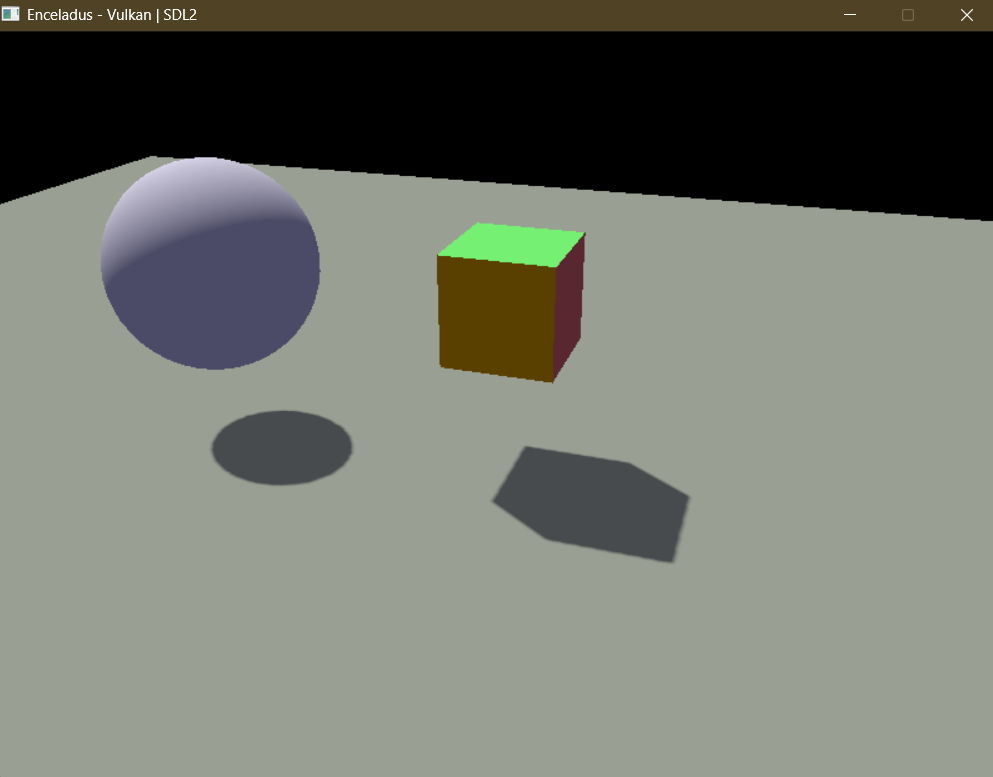

# Enceladus - Vulkan/SDL2 Project

A cross-platform C++ project for developing with Vulkan and SDL2 using CMake.

## Features

- **Vulkan Graphics Rendering**: High-performance 3D graphics using Vulkan API
- **SDL2 Windowing**: Cross-platform window management and input handling
- **3D Camera System**: FPS-style camera with WASD movement, mouse look, and vertical controls (E/Q)
- **Renderable Shapes**: Triangle and Cube primitives with customizable colors
- **Per-Face Cube Coloring**: Each face of the cube has a distinct color for visual clarity
- **Depth Testing**: Proper 3D rendering with depth buffer and backface culling
- **Shadow Mapping**: Real-time shadows with Percentage Closer Filtering (PCF) for soft shadow edges
- **Shader Pipeline**: Custom vertex and fragment shaders for rendering
- **Matrix Transformations**: Model-view-projection matrices for 3D transformations
- **Push Constants**: Efficient per-object data passing to shaders
- **Descriptor Sets**: Camera uniform buffers for view and projection matrices
- **Indexed Drawing**: Optimized rendering using vertex and index buffers
- **Lighting System**: Directional lighting with ambient and diffuse components



## Project Setup from Scratch

### Prerequisites by Platform

#### Windows (MSYS2 MinGW64 or UCRT64)

1. **Install MSYS2** from [msys2.org](https://www.msys2.org/).

2. **Open an appropriate MSYS2 terminal** – either the "MSYS2 MinGW 64-bit" or
   the newer "MSYS2 UCRT64" shell.  The two environments provide different
   toolchains; the project works with either.  Do **not** use the generic
   "MSYS2 MSYS" shell.

3. **Update package metadata and core system:**
   ```bash
   pacman -Syu
   ```

4. **Install build tools and libraries:**
   ```bash
   # Core tools (same for both prefixes)
   pacman -S mingw-w64-x86_64-cmake mingw-w64-x86_64-gcc mingw-w64-x86_64-make

   # Vulkan headers/libs and SDL2
   pacman -S mingw-w64-x86_64-vulkan mingw-w64-x86_64-sdl2
   ```

> If you opened the UCRT64 shell you can still use the MinGW packages; they
> live under `/mingw64` just as before.  The two prefixes share a common
> `pacman` database.

5. **(Optional) Install VS Code extensions:**
   - C/C++ (ms-vscode.cpptools)
   - CMake (twxs.cmake)
   - CMake Tools (ms-vscode.cmake-tools)

#### Linux (Ubuntu/Debian)

```bash
# Install CMake and build tools
sudo apt-get update
sudo apt-get install cmake build-essential git

# Install Vulkan development libraries
sudo apt-get install libvulkan-dev vulkan-tools

# Install SDL2 development libraries
sudo apt-get install libsdl2-dev
```

#### Linux (Fedora/RHEL)

```bash
# Install CMake and build tools
sudo dnf install cmake gcc-c++ make git

# Install Vulkan development libraries
sudo dnf install vulkan-loader-devel vulkan-headers vulkan-tools

# Install SDL2 development libraries
sudo dnf install SDL2-devel
```

#### macOS

```bash
# Install Homebrew if not already installed
/bin/bash -c "$(curl -fsSL https://raw.githubusercontent.com/Homebrew/install/HEAD/install.sh)"

# Install CMake and development tools
brew install cmake sdl2 vulkan-headers vulkan-tools
```

---

## Building and Running

### Windows (MSYS2)

1. **Open an MSYS2 terminal** – either
   **"MSYS2 MinGW 64-bit"** or **"MSYS2 UCRT64"**.  Both shells work; the
   underlying toolchain prefix is `/mingw64` or `/ucrt64` respectively.

2. **Change to the project directory:**
   ```bash
   cd /c/path/to/enceladus
   ```

3. **Build with the helper script:**
   Run the batch file from a Windows cmd or PowerShell prompt:
   ```cmd
   .\build.bat
   ```
   The script examines the `MSYSTEM` variable (set by the MSYS2 shell) and
   forces the Unix Makefiles generator when it contains `MINGW` or `UCRT`.
   It executes under `cmd.exe`, so it will use whatever `cmake` is on your
   native PATH.  When invoking from inside MSYS2 you can instead run the
   POSIX version (next step).

   _Note: CMake generators are sticky.  If you switch generators (e.g.
   build once with Visual Studio and then again with Makefiles) delete the
   `build/` directory first to avoid configuration conflicts._

4. **(MSYS2-only)** you can use the Bash script directly:
   ```bash
   ./build.sh
   ```
   This variant runs entirely inside MSYS2, so it automatically picks up
   the `cmake`, `g++`, and `make` from the active prefix (mingw64 or
   ucrt64).  Ensure CMake is installed via pacman (`pacman -S \
   mingw-w64-x86_64-cmake`) and restart the shell after installing.  Check
   `which cmake` or `cmake --version` before proceeding.

   You can also invoke CMake manually:
   ```bash
   # MSYS2/MinGW64 or UCRT64
   cmake -B build -S . -G "Unix Makefiles"
   cmake --build build
   
   # Native Windows (Visual Studio)
   cmake -B build -S .
   cmake --build build
   ```

4. **Run the executable:**
   ```bash
   ./build/src/enceladus.exe
   ```


### Linux / macOS

1. **Navigate to project directory:**
```bash
cd /path/to/enceladus
```

2. **Build:**
```bash
cmake -B build -S . 
cmake --build build
```

3. **Run the executable:**
```bash
./build/src/enceladus
```

---

## Troubleshooting

### CMake cannot find Vulkan or SDL2

**Windows (MSYS2):** Ensure you're using either the "MSYS2 MinGW 64-bit" or
"MSYS2 UCRT64" terminal – not the generic "MSYS2 MSYS" shell.  Verify the
vulkan/SDL2 packages are installed:
```bash
pacman -Q mingw-w64-x86_64-vulkan mingw-w64-x86_64-SDL2
```

### CMake complains `CMAKE_MAKE_PROGRAM is not set`

This means the Unix Makefiles generator was selected but no `make` binary is
on your PATH.  The MSYS2 package provides the tool, but in some prefixes the
executable is named `mingw32-make` (or `mingw64-make`) instead of plain
`make`.  The build script will now detect and use either name, but you can
also create a symlink:

```bash
pacman -S mingw-w64-x86_64-make
# create a convenience alias if necessary
ln -s /usr/bin/mingw32-make /usr/bin/make
```

**Linux:** Install the `-dev` packages (libvulkan-dev, libsdl2-dev), not just the runtime libraries.

### Build fails with "SDL2::SDL2" not found

Delete the build directory and reconfigure from scratch:
```bash
rm -rf build
cmake -B build -S .
cmake --build build
```

### VS Code IntelliSense doesn't recognize headers

1. Press `Ctrl+Shift+P` and run "C/C++: Edit Configurations (UI)"
2. Verify the compiler path is set to your g++ location
3. Reload VS Code (`Ctrl+Shift+P` → "Developer: Reload Window")

---


## Contributing

This project is a learning exercise for Vulkan and C++ graphics programming. Physics integration is planned for upcoming releases. Feel free to fork and experiment with additional features such as:

- Texture mapping
- Advanced lighting and materials
- More complex geometries
- Animation systems
- GUI integration with ImGui
- Performance optimizations

## License

This project is open source and available under the MIT License.
